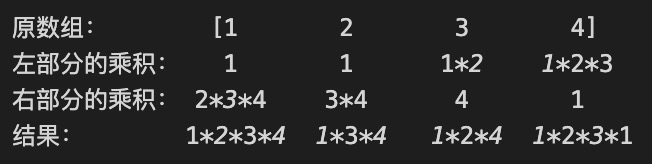

### 238.除自身以外数组的乘积
 
1. 从左右两个方向分别遍历；从下面的图可以看出，当前位置的结果就是它左部分的乘积再乘以它右部分的乘积。因此需要进行两次遍历，第一次遍历用于求左部分的乘积，第二次遍历在求右部分的乘积的同时，再将最后的计算结果一起求出来。

[Leetcode Link](https://leetcode-cn.com/problems/product-of-array-except-self/)